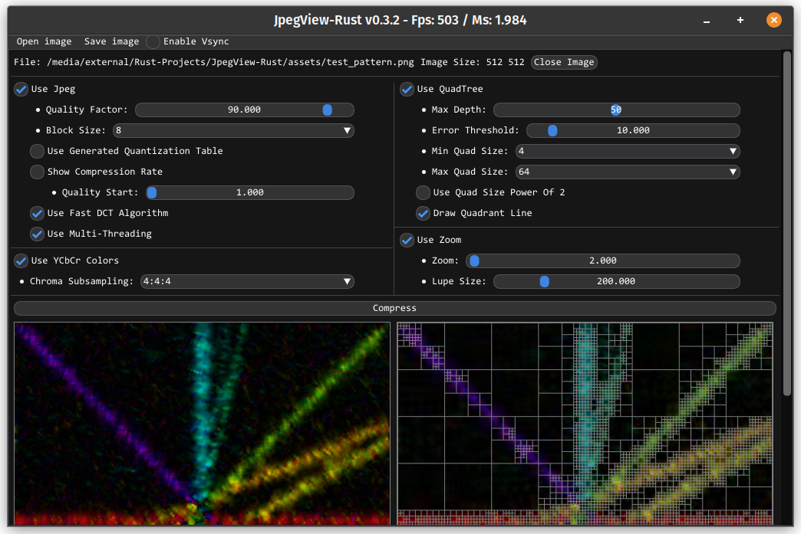

# JpegView-Rust
How To Jpeg DCT Quantize And QuadTree Compression Works Using Rust

## Help From:
* https://github.com/ocornut/imgui
* https://fr.wikipedia.org/wiki/JPEG
* https://en.wikipedia.org/wiki/JPEG   
* https://github.com/leogouttefarde/JPEG
* https://github.com/yacinemezaguer/JPEGVis
* https://github.com/TannerYork/Region-Quadtree

